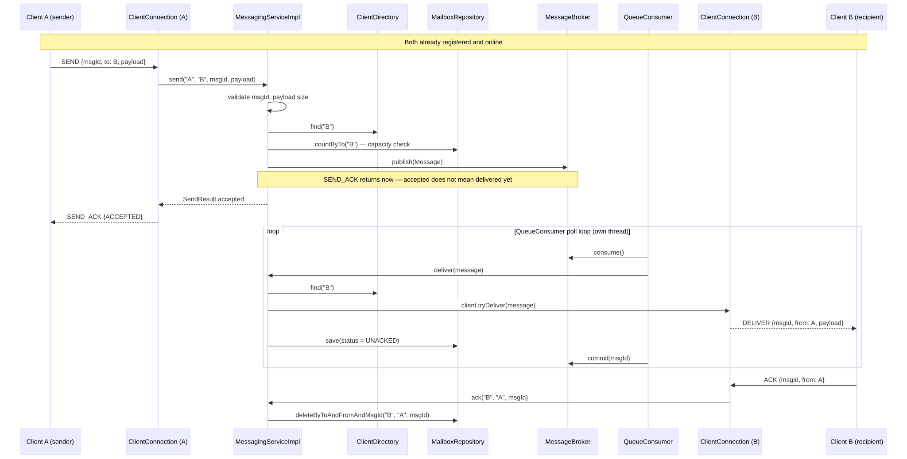

# Approach

## Acceptance criteria

| # | Requirement | Satisfied by |
|---|---|---|
| 1 | Client registers with a unique id; more than one at once | `MessagingServiceImpl.register`, backed by `ClientDirectory`'s concurrent map |
| 2 | Either client can send an addressed, uniquely-identified message | `MessagingServiceImpl.send(fromId, toId, msgId, payload)` |
| 3 | Service confirms accept/reject | `SendResult` (`ACCEPTED`/`REJECTED` + code/reason) → `SEND_ACK` frame |
| 4 | Recipient receives and explicitly acknowledges | `DELIVER` out, `ACK` in, `MessagingServiceImpl.ack` |
| 5 | Disconnect retains messages within limits | `Client.detach()` keeps identity; `MailboxRepository` (H2) retains rows; `relay.storage.max-mailbox-size` bounds it |
| 6 | Reconnect with same id receives offline messages | `ClientDirectory.getOrCreate` returns the same `Client`; `register` redelivers pending rows inline |
| 7 | Delivered-but-unacked survives disconnect, redelivered on reconnect | `UNACKED` rows deleted only by `ack`; redelivered in `register`'s pass |

The rest of the exercise's "behaviour to get right" bullets (bounded resources, ordering/duplicate/stale
handling, isolation under load, predictable shutdown) are covered by the sections below, and in more
depth in [protocol-details.md](docs/protocol-details.md).

## Architecture

Packages split by what a class knows and who it talks to, one top-level package per concern:

```
domain/          — business rules; no Frame, no Socket type implementation details
  client/        — Client identity, presence, channel (ClientChannel port)
  messaging/     — Message, delivery state, MessagingService (the one contract), MailboxRepository (storage port),
                    MessageBroker (queue port)

orchestration/   — driving adapters: translate an external event into one call on MessagingService, no business policy of its own
  ClientConnection  — per-socket I/O + REGISTER/SEND/ACK event dispatch
  QueueConsumer     — async delivery worker, consumes new events to be handled

transport/       — TCPRelayServer (accept loop); no awareness that MessagingService exists

protocol/        — Frame, FrameCodec, Operations, ProtocolException — the public wire
                   contract, varies independently of transport

broker/          — InMemoryMessageBroker (driven adapter for the MessageBroker port)

config/          — ApplicationConfig, *Propertiesy 
```

`MessagingService` owns every business decision. 
`ClientConnection` and `QueueConsumer` are thin callers with zero policy of their own — one triggered by a socket event, the other by a broker item.

## End-to-end flow

Only the named clients (Client A, Client B) are external to us; everything else in the diagrams is our
own server-side code, reached only by opening a TCP socket and speaking the protocol below — never
called directly. The core one is embedded below; the rest are linked.

**Send → async deliver → ack** — the core message lifecycle.



The other three events, each its own diagram:
- [Register](docs/reference/flow-register.svg) — a fresh client connects and registers.
- [Disconnect → reconnect with redelivery](docs/reference/flow-disconnect-reconnect.svg) — the recipient
  goes offline, a message queues instead of delivering, then reconnecting with the same `clientId`
  redelivers everything pending.
- [Shutdown](docs/reference/flow-shutdown.svg) — bounded, blocking server stop.

## Protocol

Plain TCP on `host:5555` (configurable), one JSON object per line.

**Operations**

| Op | Who sends it | What it means |
|---|---|---|
| `REGISTER` | client | "I'm here, under this id" — first message on every connection |
| `SEND` | client | "deliver this payload to that other client" |
| `ACK` | client | "I got that `DELIVER`, you can stop redelivering it" |
| `REGISTER_OK` / `REGISTER_ERR` | server | registration accepted / rejected |
| `SEND_ACK` | server | your `SEND` was accepted onto the queue, or rejected |
| `DELIVER` | server | unsolicited — another client sent you something |
| `ERROR` | server | something about your last message was wrong |

**How a conversation actually looks** — alice and bob, start to finish:
```
alice → server : {"op":"REGISTER","clientId":"alice"}
server → alice : {"op":"REGISTER_OK"}

bob   → server : {"op":"REGISTER","clientId":"bob"}
server → bob   : {"op":"REGISTER_OK"}

alice → server : {"op":"SEND","msgId":"m1","to":"bob","payload":"hi"}
server → alice : {"op":"SEND_ACK","msgId":"m1","status":"ACCEPTED"}
server → bob   : {"op":"DELIVER","msgId":"m1","from":"alice","payload":"hi"}
bob   → server : {"op":"ACK","msgId":"m1","from":"alice"}
```
Both register once, up front — the diagram's own note covers the accept-vs-delivered timing. Had bob been
offline instead, the `DELIVER` would simply wait until he reconnects with the same `clientId`: nothing is
lost, and reconnecting evicts any stale socket still registered under that id.

Try it hands-on with `scripts/test-client.ps1` (see README.md). For every operation's full field list,
more JSON examples, and error/bound handling, see [protocol-details.md](docs/protocol-details.md).

## Delivery semantics

- **At-least-once.** A message is removed only by an explicit `ACK`, scoped to `(to, from, msgId)`. Until
  acked, it's redelivered on every reconnect.
- **`msgId` is unique per sender, not globally.** It's a sender-supplied idempotency key, scoped as
  `(from, msgId)`. A duplicate `SEND` (same sender replaying the same `msgId`) is accepted idempotently,
  no second delivery. Two *different* senders may reuse the same `msgId` value for unrelated messages —
  both are delivered, which is why `ACK` also carries `from`: otherwise one sender's ack could remove the
  other's still-pending message.
- **Stale/repeated `ACK`** (well-formed, but no matching row) is a silent no-op. A **malformed** `ACK`
  (missing `msgId` or `from`) is different and rejected outright with `ERROR{INVALID_ACK}` — without both
  fields the request can't unambiguously target one message, so treating it as a silent no-op would look
  identical to a harmless stale ack and hide a real client bug.
- **Ordering** is FIFO per recipient (unacked messages first, then queued, both oldest-first).

## State and concurrency model

- `ClientDirectory` is a concurrent map that never removes entries, so a reconnect always finds the same
  identity.
- Each socket runs on its own virtual thread with its own write queue — a slow or malformed client can't
  block the accept loop or other connections.
- Mailbox storage is real transactional H2/JPA; concurrency correctness there is Hibernate/JDBC's job.

## Design choices

- **STORAGE — H2, AN RDBMS, FOR SIMPLICITY:** fastest way to get real persistence without extra setup for
  a short exercise. *Not necessarily the production answer* — the real access pattern (per-recipient
  lookups, mostly writes) might fit a document store or Cassandra better; that's a later call.
- **BROKER — A QUEUE, NOT INLINE DELIVERY, ON PURPOSE:** accepting a `SEND` and actually delivering it are
  kept as two separate steps to limit blast radius. If delivery is slow or breaks, it should never block
  or take down accepting the next one. *Whatever can go wrong, will* — so the two are decoupled on
  purpose, not merged for convenience. (An external broker like Kafka/RabbitMQ isn't on the table either
  way — the exercise requires the relay to own delivery itself.)
- **I/O — BLOCKING SOCKETS ON VIRTUAL THREADS, NOT NETTY/WEBFLUX:** the socket code itself is plain,
  old-style blocking `java.net.Socket` — nothing new there. What's new is Java 21 virtual threads: a
  blocked thread no longer ties up a scarce OS thread, so this scales like non-blocking I/O while the
  code stays simple, sequential, and easy to debug. Netty or WebFlux would buy the same scale at the cost
  of callback/reactive complexity this scope doesn't need.

## Testing

Commands in README.md. What's covered:

- **UNIT TESTS:** every class has its own test, collaborators mocked.
- **END-TO-END TEST:** one real test, real socket and real database, covering concurrency, cross-client
  isolation, and shutdown.
- **MANUAL TEST SCRIPT:** `scripts/test-client.ps1`, to exercise a running server by hand.
- **NOT COVERED, ON PURPOSE:** load/throughput benchmarking, protocol fuzzing, multi-server setups.

## Known limitations

- **NO RESTART PERSISTENCE:** H2 runs in-memory (`mem:`), no schema migration tool — state resets on
  every restart.
- **BROKER IS IN-MEMORY, SINGLE-PROCESS:** nothing published to it survives a restart, and it can't be
  shared across multiple server instances. `MessageBroker` is a port specifically so a real broker could
  replace it later — just not allowed for this exercise, which requires the relay to own delivery itself.
- **ORDERING IS TIMESTAMP-BASED, NOT A COUNTER:** uses `Instant.now()`, not a monotonic counter — two
  sends in the same clock tick could theoretically tie. Not observed in testing.
- **MAILBOX-CAPACITY CHECK ISN'T ATOMIC:** `countByTo` then publish is two operations, not one
  check-and-reserve — under extreme concurrent load to the same recipient, two sends could both pass the
  check before either publishes, slightly exceeding the cap.
- **DEDUPE WINDOW IS IN-MEMORY:** bounded, lost on restart.
- **NO CHUNKING OR COMPRESSION:** a payload goes over the wire as one plain frame — fine under
  `max-payload-bytes`, but a production system pushing larger or more frequent messages would want
  chunking and compression to keep bandwidth and memory down.
- **NO MIME TYPE OR MEDIA SUPPORT:** `payload` is a plain string, text only — no way to tag or carry
  images, files, or other media today.
- **NO AUTHENTICATION OR ENCRYPTION:** explicitly out of scope per the exercise.

## Next steps

1. Docker image (deferred until the core solution was complete, per the exercise's own guidance).
2. Persistence across restart: point H2 at a file, add startup schema verification.
3. Replace timestamp-based ordering with a per-recipient sequence counter if strict same-millisecond
   FIFO becomes a real requirement.

## AI-tool usage

Built with Claude (Claude Code) across several interactive session — not a single prompt.

- **Process**: identify the domain's owners and agree a directory structure → write a plan covering that
  structure and every contract → TDD (tests against the contracts, then implementation in stages,
  verified after each) → an end-to-end concurrency test → independent code review → structural
  refinement → documentation.
- **Verification**: every stage substantiated by actually running `mvn compile`/`mvn test`, never assumed.
- **Bugs found by testing, not by inspection**:
  - A custom delete query failed only against real JPA, not mocks. Fix: added `@Transactional`.
  - Background workers' `stop()` returned before their threads actually finished. Fix: each join is
    bounded before returning.
  - The jar exited right after "Started" since virtual threads are always daemon. Fix: `main()` blocks
    on a latch.
  - `send()` ignored a failed broker publish, so a full queue looked like success. Fix: reject with
    `BROKER_UNAVAILABLE`.
  - A full write queue could silently drop `SEND_ACK`. Fix: close the connection instead of a false
    accept.
  - Two different senders using the same `msgId` both got accepted, but only one was ever delivered.
    Fix: scoped uniqueness to sender plus `msgId`, not globally.
- **Explicit design calls**: H2/JPA as storage, a synchronous mailbox-capacity check, timestamp-based
  ordering as a documented trade-off, and the `domain`/`orchestration` package split with every
  technical concern (transport, protocol, broker) as its own top-level package.

### Prompt sequence used to build this

**0. State the problem**
> Heres the exercise: build a small client/server message relay. Clients register with an id, send
> messages to each other, ack delivery explicitly, and if someone is offline the messages have to be
> retained and redelivered when they reconnect. I get to pick the protocol and language, its roughly a
> two-hour scope, and theyre grading the reasoning more than the feature count. Dont jump to a design
> yet, lets actually go through the protocol trade-offs first.

**1. Compare protocol options**
> Before we design anything, walk me through the transport options the exercise actually allows: TCP,
> HTTP, RPC, gRPC. Throw WebSocket into the mix too since thats what most people would actually reach
> for in a real system. Give me the real trade-offs for each, not just a feature list. Picking the wrong
> one now is expensive to walk back later.

**2. Weigh the pain points and settle on TCP**
> HTTP has no real push, the server cant send anything without the client asking first, so
> REGISTER/SEND/ACK/DELIVER would mean polling. gRPC can stream both ways which is closer, but it hands
> you most of the framing instead of you designing it, and it also doesnt play well with a browser
> client down the line, youd need grpc-web and a proxy in front of it. WebSocket is honestly what most
> people would pick for something like this in production, its built into every browser, but it still
> drags in the HTTP handshake and web server stack for something that never touches a browser here. TCP
> gives a persistent two way connection with nothing prescribed on top and full control over the wire
> format, and it stays inside what the exercise allows either way. Going with TCP, is that the right
> call?

**3. Identify the domain's owners**
> Read through the requirements doc. Before any code, figure out the real owners in this domain, the
> nouns and responsibilities that should become their own type or service (a Client owning identity and
> presence, a Message owning delivery state, a MessagingService owning the rules between them, that kind
> of thing). List them out with what each one owns. I want to agree on this before a single class gets
> named.

**4. Propose and finalize the directory structure**
> Based on those owners, propose a directory structure that keeps business rules separate from the
> technical machinery: package by feature for anything business-relevant, package by technical
> capability for the rest. Ill check it against how I actually understand the domain myself, only
> signing off once it matches how Id explain this system to someone.

**5. Write the plan: structure plus contracts**
> Write up a plan with the finalized directory structure, and for every class or interface in it, its
> contract: method signatures, what each one promises, no implementation detail. I want every contract
> agreed on now, not a mismatch discovered halfway through building it.

**6. Write tests against the contracts first**
> For each contract we agreed on, write the tests before any implementation exists, against the
> interface only. Mock every collaborator, check both the return value and that the right collaborator
> methods actually got called. Id rather a wrong assumption fail a test now than show up as a bug later.

**7. Implement one piece at a time**
> Build this in stages, not all at once. Socket-accepting logic first, then the frame read/dispatch
> logic off an accepted socket, then the async delivery worker, and so on. Run the tests after each stage
> and show me the real output. I want to approve one working piece before the next one gets built on top
> of it.

**8. Add one end-to-end test against the real thing**
> Once everything is green at the unit level, write one end-to-end test against a real socket and real
> storage, no mocks, covering concurrent clients, a malformed or stalled client, and a full shutdown.
> Mocked tests wont catch real timing or concurrency issues, and I want that covered before I actually
> trust this.

**9. Give me a way to test it by hand**
> Give me a script, or exact steps, to manually exercise this using two terminal sessions, one acting as
> each client. I want to watch a real message go from one socket to the other myself, not just take the
> test suite's word for it.

**10. Independent code review**
> Audit the finished codebase for [specific list of suspected bugs or smells, each with a concrete
> failure scenario]. Confirm each one against the actual code before fixing anything. Only want real,
> confirmed issues fixed, not speculative ones.

**11. Push on structure until its right**
> Not everything technical belongs in one bucket: some of its pure machinery, some of it calls into
> the business layer. Split those apart, and keep splitting or renaming anything whose name doesnt
> actually describe whats inside it. Id rather fix a misleading name now than have someone waste time
> on it later.

**12. Document it**
> Write the README and approach doc in plain language someone can actually get through. One diagram per
> distinct event instead of one giant one, one clear protocol example. A reviewers only getting a few
> minutes with this, so it has to respect that.
